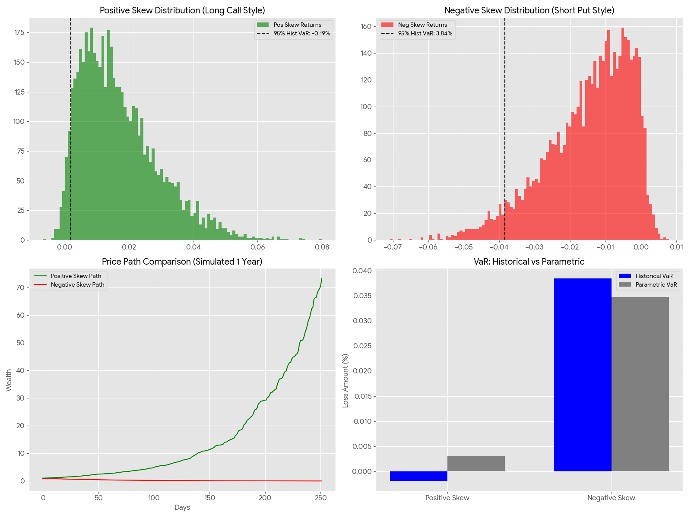

在 FRM 考试中，**偏度（Skewness）** 与 **峰度（Kurtosis）** 是风险度量比较关键的指标，尤其是评估非正态分布的资产。

## 正偏 vs 负偏：概念对比

### 1. 正偏分布 (Positive Skewness / Right-Skewed)
* **概念：** 数据的“尾巴”拖向右侧（正收益方向）。这意味着出现极大正收益的概率虽低，但潜在获利空间巨大。数学特征为：**均值 (Mean) > 中位数 (Median) > 众数 (Mode)**。这种分布锁定了左侧亏损（通常有限），但保留了右侧无限的想象空间。
* **风险评估：** 对于正偏资产，传统的 VaR 可能会显得过于保守，因为它只关注左尾，而忽略了该资产具备的“彩票型”高收益潜力。
* **典型产品：** 买入看涨期权 (Long Call)、风险投资 (VC)、不良资产投资。
* **期权**    
    * **表现：** 当你买入看涨期权（Long Call）或看跌期权（Long Put）时，你的收益分布是极端正偏的。
    * **亏损有限：** 你最大的损失仅限于支付的权利金（Premium），这锁定了分布的左侧（亏损端）。
    * **收益无限（或极大）：** 随着标的资产价格向有利方向大幅波动，你的盈利理论上可以无限大。
    * 期权具有**非线性（Non-linear）** 的损益特征。这种“收益不对称性”直接导致了概率分布向右侧拉长。
* **信用风险与不良资产**
    * 虽然大多数债券呈现负偏（平时收利息，一旦违约就暴雷），但**深度折价的不良资产投资**却可能呈现正偏。
    * **场景：** 以 10 分钱的价格买入面值 100 分的违约债券。
    * **底部锁定：** 最多亏掉这 10 分钱。
    * **潜在暴利：** 如果公司重组成功，资产价值可能翻数倍（甚至回到 100 分）。
    * **逻辑：** 这本质上是把债权变成了“类似期权”的博弈。
* **风险投资与初创企业**
    * **表现：** 投资 10 个项目，8 个归零，1 个保本，1 个成为“独角兽”（如 OpenAI 或 SpaceX）带来 1000 倍回报。
    * **为什么：** 初创企业的股权价值不可能低于零，但其增长空间几乎没有上限。
    * **收益特征：** 均值（Mean）会被那个极端正收益拉高，导致 **均值 > 中位数 > 众数**。
* **动量策略 (Momentum Strategy) 与 趋势跟踪**

    * 在量化投资中，趋势跟踪策略（Trend Following）往往表现出正偏。
    * **逻辑：** 这种策略遵循“截断亏损，让利润奔跑（Cut losses short, let profits run）”。
    * **结果：** 频繁的小额亏损（左侧密集的短柱）和偶尔抓住超级大趋势带来的暴利（右侧的长尾）。

### 2. 负偏分布 (Negative Skewness / Left-Skewed)
* **概念：** 数据的“尾巴”拖向左侧（极端亏损方向）。这意味着平时表现极其稳健，但一旦出事就是毁灭性的打击。数学特征为：**均值 (Mean) < 中位数 (Median) < 众数 (Mode)**。它是银行和监管机构最担心的“隐形杀手”，容易给投资者造成低风险的错觉。
* **包含峰度与肥尾 (Kurtosis & Fat Tails)：**
    * **肥尾 (Fat Tails)：** 负偏通常伴随着 **高峰态 (Leptokurtotic)**，即峰度大于 3。在分布图中表现为中间更尖、两边尾巴更厚。
    * **风险逻辑：** 肥尾意味着极端亏损发生的频率远高于正态分布的预测。
* **VaR 失灵：** 传统 VaR 若假设正态分布，会严重低估负偏资产的左尾风险，因为现实中的“肥尾”让崩盘概率大增。
* **典型产品：** 卖出期权 (Short Options)、信用债 (Credit Bonds)、卖出 CDS。
* **卖出期权**
    * **表现**：作为卖方，你平时赚取的是稳定的权利金（Premium）。
    * **为什么**：只要标的价格波动没超过行权价，你就稳赚。但一旦发生极端价格波动（如 1987 年“黑色星期一”），你的亏损无上限。
* **信用债与贷款**
    * **表现**：债券投资的收益分布天然负偏。
    * **为什么**：你最好的情况就是按期收回本金和利息（收益上限锁定）。但最坏的情况是公司破产，你损失绝大部分本金。
* **卖出信用违约掉期**
    * **案例**：2008 年金融危机中的 AIG 公司。
    * **逻辑**：平时像收保险费一样稳赚，但只要参考实体发生违约，就需要赔付巨额资金。这就是典型的“赚小钱、亏大命”。
* **携带交易**
    * **场景**：借入低利率货币（如日元），投资高利率货币。
    * **风险**：平时赚取利差，但一旦发生汇率剧烈反转（Unwind），极短时间内就会吞掉数年的利润。
* **波动率微笑 (Volatility Smile)**
    * 由于金融市场（尤其是股票）经常表现出负偏特征，投资者对左侧极端的担忧反映在期权价格上，就形成了**波动率歪斜（Volatility Skew）**——低行权价（虚值看跌期权）的隐含波动率通常更高。

## 快速记忆小故事
- **正偏中彩票**：买期权、买保险
    - 你每天带100块去赌场，只玩那种“中奖率极低但奖金千万”的博彩。每天大概率亏掉100块，这是**有限的左侧亏损**。但有一天突然中了头奖，收益曲线可以瞬间拉出一个**长长的右尾**。
- **负偏踩地雷**：卖期权、卖保险
    - 你在场外借钱给别人，每天稳定收 1 块钱利息，日子过得极稳（**高峰态**）。但在一个雷雨交加的夜晚，所有的借款人集体跑路了，你不仅赔光了本金还欠了一屁股债。这种平时稳赚、一亏就破产的**左侧长尾**，就是**负偏**。

## Python可视化
在本次模拟中生成了 5000 个样本，分别计算 **95% 置信水平下的历史 VaR**（基于实际发生的损益百分比）和 **参数 VaR**（假设收益率服从正态分布）。



#### 1. 模拟数据
| 维度 | 正偏资产 (Positive Skew) | 负偏资产 (Negative Skew) |
| --- | --- | --- |
| **平均收益率 (μ)** | +1.70% | −1.49% |
| **标准差 (σ)** | 1.22% |  1.21%|
| **95% 历史 VaR** | −0.19% (意味着 95% 情况下仍是盈利) | 3.84%|
| **95% 参数 VaR (假设正态)** | 0.30% | 3.47% |

#### 2. 模拟数据分析
#### （1）负偏资产的VaR被低估了
* 当你使用传统的参数法（假设正态分布）计算风险时，模型会告诉你最大亏损只有3.47%。但由于**肥尾（Fat Tails）** 的存在，现实中5%的极端亏损情况实际上达到了3.84%。
* 这种差额是“模型风险”。对于卖出期权或信用债等负偏资产，**正态分布假设会显著低估真实风险**。

#### （2）正偏资产的VaR被高估了
* 虽然绝大多数观测值集中在左侧（较小的盈利或亏损），但那条**向右伸展的长尾**拉高了整体均值，使得风险度量看起来非常“温和”。

#### （3）其他可视化分析
1. **左上图 (Positive Skew)**：分布像一个“向右撇”的坡。大部分数据在左边，但右边有零星的、巨大的正收益，这就是“彩票”的魅力。
2. **右上图 (Negative Skew)**：分布像一个“向左斜”的尖峰。中间部分非常瘦高（**高峰态**），说明平时波动极小，但左侧有一条长长的阴影区，那便是**暴雷区**。
3. **下方路径图**：
* **绿色线 (正偏)**：平时平平无奇，偶尔一个“旱地拔葱”式的暴涨。
* **红色线 (负偏)**：平稳向上爬坡很久，然后突然一个“断崖式”下跌。
4. **右下柱状图 (VaR 对比)**：清晰展示了在负偏情况下，历史 VaR（真实情况）是如何击穿参数 VaR（模型预测）的。


## 附Python代码
```
import numpy as np
import pandas as pd
import matplotlib.pyplot as plt
from scipy.stats import skewnorm, norm

# Parameters
n_samples = 5000
confidence_level = 0.95
mean_ret = 0.001
vol = 0.02

# 1. Generate Skewed Returns
# Positive Skew (Long Options / VC style)
pos_skew = 10
pos_returns = skewnorm.rvs(pos_skew, loc=mean_ret, scale=vol, size=n_samples)

# Negative Skew (Short Options / Credit style)
neg_skew = -10
neg_returns = skewnorm.rvs(neg_skew, loc=mean_ret, scale=vol, size=n_samples)

# 2. Calculate Historical VaR (95%)
# VaR is typically expressed as a positive number representing a loss.
# We take the 5th percentile of returns.
var_95_pos = -np.percentile(pos_returns, (1 - confidence_level) * 100)
var_95_neg = -np.percentile(neg_returns, (1 - confidence_level) * 100)

# Calculate Parametric VaR (assuming normality) for comparison
# Parametric VaR = - (mean - z * vol)
z_score = norm.ppf(1 - confidence_level)
param_var_pos = -(np.mean(pos_returns) + z_score * np.std(pos_returns))
param_var_neg = -(np.mean(neg_returns) + z_score * np.std(neg_returns))

# 3. Visualization
plt.style.use('ggplot')
fig, axes = plt.subplots(2, 2, figsize=(16, 12))

# Subplot 1: Positive Skew Distribution
axes[0, 0].hist(pos_returns, bins=100, color='green', alpha=0.6, label='Pos Skew Returns')
axes[0, 0].axvline(-var_95_pos, color='black', linestyle='--', label=f'95% Hist VaR: {var_95_pos:.2%}')
axes[0, 0].set_title("Positive Skew Distribution (Long Call Style)")
axes[0, 0].legend()

# Subplot 2: Negative Skew Distribution
axes[0, 1].hist(neg_returns, bins=100, color='red', alpha=0.6, label='Neg Skew Returns')
axes[0, 1].axvline(-var_95_neg, color='black', linestyle='--', label=f'95% Hist VaR: {var_95_neg:.2%}')
axes[0, 1].set_title("Negative Skew Distribution (Short Put Style)")
axes[0, 1].legend()

# Subplot 3: Price Path Comparison (first 252 days)
pos_path = (1 + pos_returns[:252]).cumprod()
neg_path = (1 + neg_returns[:252]).cumprod()
axes[1, 0].plot(pos_path, label='Positive Skew Path', color='green')
axes[1, 0].plot(neg_path, label='Negative Skew Path', color='red')
axes[1, 0].set_title("Price Path Comparison (Simulated 1 Year)")
axes[1, 0].set_xlabel("Days")
axes[1, 0].set_ylabel("Wealth")
axes[1, 0].legend()

# Subplot 4: VaR Summary Table-like bar chart
categories = ['Positive Skew', 'Negative Skew']
hist_vars = [var_95_pos, var_95_neg]
param_vars = [param_var_pos, param_var_neg]

x = np.arange(len(categories))
width = 0.35

axes[1, 1].bar(x - width/2, hist_vars, width, label='Historical VaR', color='blue')
axes[1, 1].bar(x + width/2, param_vars, width, label='Parametric VaR', color='gray')
axes[1, 1].set_ylabel('Loss Amount (%)')
axes[1, 1].set_title('VaR: Historical vs Parametric')
axes[1, 1].set_xticks(x)
axes[1, 1].set_xticklabels(categories)
axes[1, 1].legend()

plt.tight_layout()
plt.savefig('skewness_var_comparison.png')

# Output relevant numbers for text response
print(f"Positive Skew - Mean: {np.mean(pos_returns):.4f}, Std: {np.std(pos_returns):.4f}, Hist VaR 95%: {var_95_pos:.4f}, Param VaR 95%: {param_var_pos:.4f}")
print(f"Negative Skew - Mean: {np.mean(neg_returns):.4f}, Std: {np.std(neg_returns):.4f}, Hist VaR 95%: {var_95_neg:.4f}, Param VaR 95%: {param_var_neg:.4f}")
```
